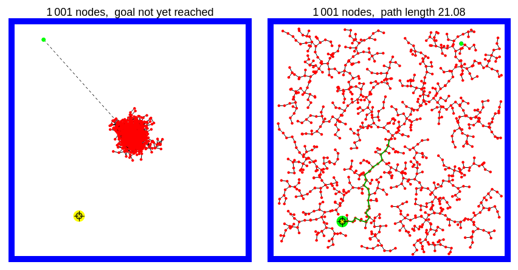

# RRT-RL

## Introduction

This is the code for the journal paper *Rapidly Exploring Random Trees Reinforcement Learning (RRT-RL): A New Era in Training Sample Diversity* by István Péter, Bálint Kővári and Tamás Bécsi (https://www.mdpi.com/2079-9292/14/3/443).

Our work builds on [[1]](#citations), which introduces an application of the Rapidly Exploring Random Trees (RRT) to a lane keeping Reinforcement Learning (RL) problem.

The RRT algorithm was initially developed for path-finding in robotics, but due to its characteristic for asymptotically optimal coverage of the state space (see below), we use it to cover various benchmark RL problems' state space with fewer samples while keeping similar or better validation reward.


*Random search versus RRT in path finding. Source: https://demonstrations.wolfram.com/RapidlyExploringRandomTreeRRTAndRRT/*

We apply the algorithm by interpreting environment states as nodes in a tree, with the distance metric between them being the *cosine similarity of the softmax-normalized Q vectors* corresponding to the state (an improvement over [1], which uses the euclidean distance of states). The Q-vector is taken from a reference DQN network that was trained on a limited set of random pre-collected samples.

We demonstrate that even this 'weak' guidance being incorporated along the RRT algorithm gives us the ability to collect more diverse samples, and surpass the performance of the reference agent with a fraction of the training data when trained from sratch, showing that our method does not merely "distill" the base model, but builds a better and more sample-efficient set of experiences. 

We also expand upon [1] by generalizing the scope from lane keeping to three different benchmark RL problems, as seen in the paper.

### Citations
[1] Bécsi, T. *RRT-guided experience generation for Reinforcement Learning in autonomous lane keeping.* Sci. Rep. 2024, 14, 24059.

## Setup and reproducing results

After cloning the repository, set up a virtual environment, and run
```bash
pip install -r requirements.txt
```
Then run comparison script via
```bash
python compare_fair.py [-c ENV]
```
where `ENV` is `cartpole-rrt` (default), `acrobot-rrt` or `mountain-car-rrt`. 